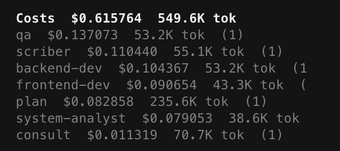

# opencode-costs

Show LLM costs and token usage per agent in OpenCode sidebar.



## Why

OpenCode shows total token usage per session, which works fine when you have a single agent.
But once you start working with multiple agents — a planner that delegates to a backend-dev,
a frontend-dev, a reviewer, and a scriber — you lose visibility into who's spending what.

This plugin breaks down costs **per agent**, so you can see at a glance which agents
are the most expensive, where token usage piles up, and whether your delegation strategy
is cost-effective.

## What it looks like

```
Costs  $0.615764  549.6K tok
qa  $0.137073  53.2K tok  (1)
scriber  $0.110440  55.1K tok  (1)
backend-dev  $0.104367  53.2K tok  (1)
frontend-dev  $0.090654  43.3K tok  (1)
plan  $0.082858  235.6K tok  (1)
system-analyst  $0.079053  38.6K tok  (1)
consult  $0.011319  70.7K tok  (1)
```

## Install

1. Open OpenCode
2. Press `Ctrl+P` (or `Cmd+P` on macOS)
3. Select **Install Plugins**
4. Type `opencode-costs` and hit Enter

Done. Costs will appear in the sidebar on your next session.

## Configuration

Override the refresh interval via environment variable:

```bash
OPENCODE_COSTS_REFRESH_MS=30000 opencode
```

| Option | Default | Description |
|--------|---------|-------------|
| `OPENCODE_COSTS_REFRESH_MS` | `15000` | Sidebar refresh interval in milliseconds (min 1000) |

## How it works

Reads session history via OpenCode API, groups by agent (e.g. `plan`, `build`, `default`),
shows cumulative cost ($) and token usage in the sidebar. Refreshes automatically and on
session events.

## Known Limitations

- **Agent attribution when switching with Tab:** OpenCode reuses the same session when
  switching between Plan/Build agents, so all costs are attributed to the last active
  agent. This is an API limitation, not a plugin bug. Totals ($, tok) remain correct.
- **Current directory only:** Only sessions from the current project directory are shown.
- **TUI only:** This plugin only works in TUI mode, not CLI.

## License

MIT
